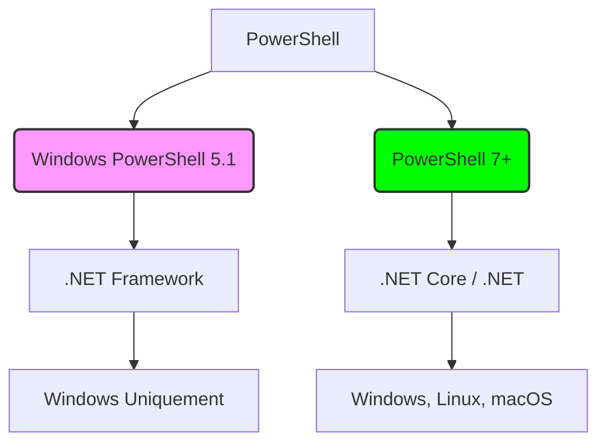
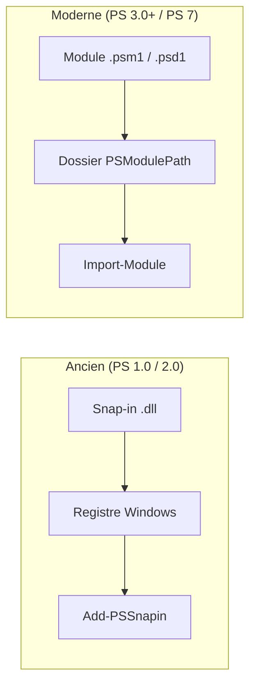
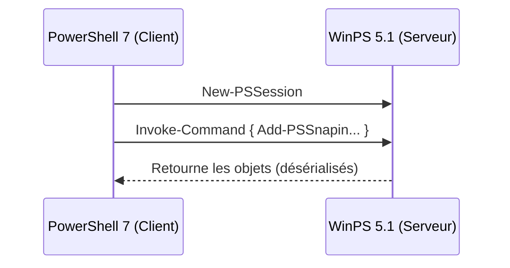

#Cours : Migration de PowerShell 5.1 vers PowerShell 7Ce cours détaille les principes fondamentaux du passage de l'architecture "Legacy" (Windows PowerShell) à l'architecture moderne et multiplateforme (PowerShell 7).

---

##1. La rupture technologique : .NET Framework vs .NET CoreLa différence majeure réside dans le moteur d'exécution. Windows PowerShell 5.1 s'appuie sur le **.NET Framework**, ce qui le limite strictement à l'écosystème Windows. PowerShell 7 repose sur **.NET Core** (ou simplement .NET 6/8), un moteur léger, modulaire et compatible avec Linux et macOS.



---

##2. L'abandon des Snap-ins au profit des ModulesDans les versions 1.0 et 2.0, PowerShell utilisait des **Snap-ins** (fichiers .dll enregistrés dans le registre Windows). Depuis la version 3.0, et de manière obligatoire en version 7, le format standard est le **Module**.

Les Snap-ins ne sont pas compatibles avec PowerShell 7 car la commande `Add-PSSnapin` n'existe plus dans cette édition.



---

##3. Stratégies de MigrationPour transformer un script utilisant de vieux Snap-ins, il existe trois approches graduelles :

###A. Remplacement directVérifier si l'éditeur a publié une version "Module" du Snap-in (ex: VMware PowerCLI ou Exchange Online).

###B. Couche de compatibilité WindowsSi aucun module PS7 n'existe, on utilise la fonction d'interopérabilité qui lance une session Windows PowerShell 5.1 en arrière-plan.

```powershell
Import-Module MonVieuxModule -UseWindowsPowerShell

```

###C. Remoting ImpliciteExécuter le code directement sur un serveur distant qui possède encore les bibliothèques d'origine.



---

##4. Tableau de correspondance
| Fonctionnalité | Windows PowerShell (v5.1) | PowerShell 7 (Core) |
| --- | --- | --- |
| **Exécutable** | `powershell.exe` | `pwsh.exe` |
| **Variable `$PSEdition**` | `Desktop` | `Core` |
| **Extension** | `Add-PSSnapin` | `Import-Module` |
| **Plateformes** | Windows uniquement | Cross-plateforme |

---

